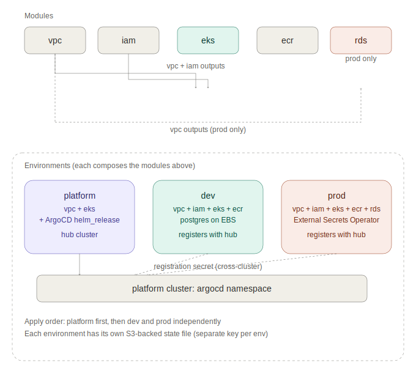

# Terraform Infrastructure

This folder contains all Infrastructure as Code for the project, covering three EKS clusters (`platform`, `dev`, `prod`), their supporting AWS resources, and the GitOps wiring that connects them to ArgoCD.

## Folder Structure

```
Terraform/
├── bootstrap/          Applied once, never destroyed. Creates the S3
│                        backend bucket used to store all other state.
├── modules/             Reusable building blocks
│   ├── vpc/              VPC, subnets, NAT, IGW, S3 gateway endpoint
│   ├── iam/              EKS cluster role + node role (no OIDC, avoids
│   │                      a circular dependency with the eks module)
│   ├── eks/              Cluster, node group, addons, Pod Identity
│   │                      Associations, EBS CSI role, External Secrets
│   │                      IAM role
│   ├── ecr/              19 repositories with lifecycle policies
│   └── rds/              PostgreSQL instance, Secrets Manager secret
│                          (prod only)
└── environments/        One folder per deployable stack
    ├── platform/          The ArgoCD hub. VPC + EKS + ArgoCD Helm
    │                       release only. No ECR, no RDS.
    ├── dev/                VPC + EKS + ECR. Postgres runs in-cluster
    │                       on EBS. Registers itself with the hub.
    └── prod/               VPC + EKS + ECR + RDS + External Secrets
                            Operator. Registers itself with the hub.
```

## Module Dependency Graph



```
vpc   -- no dependencies
iam   -- no dependencies
eks   -- needs vpc + iam outputs
         creates its own Pod Identity Associations and EBS CSI role
         internally to avoid a circular dependency between eks and iam
ecr   -- no dependencies
rds   -- needs vpc outputs (prod only)
```

Each environment also creates an `argocd-manager` ServiceAccount on its own cluster, then writes a cluster-registration Secret directly into the `platform` cluster's `argocd` namespace using a second, aliased `kubernetes` provider. See `argocd/README.md` for the full explanation of this mechanism.

## AWS Authentication: IRSA → Pod Identity Migration

This project originally used **IRSA** (IAM Roles for Service Accounts) to give the EBS CSI driver and External Secrets Operator permission to call AWS APIs from inside the cluster. It has since been migrated to **EKS Pod Identity**, AWS's newer and simpler mechanism for the same purpose. Both are documented here because the reasoning behind the switch is itself a useful record of a real tradeoff decision.

### What IRSA looked like

```hcl
# An OIDC provider had to be created per cluster
data "tls_certificate" "eks" {
  url = aws_eks_cluster.main.identity[0].oidc[0].issuer
}

resource "aws_iam_openid_connect_provider" "eks" {
  client_id_list  = ["sts.amazonaws.com"]
  thumbprint_list = [data.tls_certificate.eks.certificates[0].sha1_fingerprint]
  url             = aws_eks_cluster.main.identity[0].oidc[0].issuer
}

# Each IAM role's trust policy referenced that OIDC provider directly,
# scoped to one specific namespace:serviceaccount combination
resource "aws_iam_role" "ebs_csi" {
  assume_role_policy = jsonencode({
    Statement = [{
      Effect    = "Allow"
      Principal = { Federated = aws_iam_openid_connect_provider.eks.arn }
      Action    = "sts:AssumeRoleWithWebIdentity"
      Condition = {
        StringEquals = {
          "${...}:sub" = "system:serviceaccount:kube-system:ebs-csi-controller-sa"
        }
      }
    }]
  })
}
```

The matching Kubernetes ServiceAccount also needed an explicit annotation:

```yaml
metadata:
  annotations:
    eks.amazonaws.com/role-arn: arn:aws:iam::<account>:role/<role-name>
```

For Helm-installed components (External Secrets Operator), this annotation had to be injected via a Helm `set` value, since the chart's default ServiceAccount has no annotation of its own:

```hcl
resource "helm_release" "external_secrets" {
  set {
    name  = "serviceAccount.annotations.eks\\.amazonaws\\.com/role-arn"
    value = module.eks.external_secrets_role_arn
  }
}
```

### Why it was replaced

IRSA worked, but it had real, repeated operational friction in this project specifically:

- The annotation lived outside Terraform's direct control on cluster rebuilds that didn't go through the Helm `set` block consistently, requiring a manual `kubectl annotate` step to be re-applied after some reinstalls.
- Each IAM role's trust policy was tied to one specific cluster's OIDC provider, making the same role harder to reason about across `dev` and `prod` independently.
- AWS has explicitly positioned Pod Identity as the simpler, currently-recommended mechanism for new EKS workloads going forward.

### What Pod Identity replaced it with

No OIDC provider, no annotation, no Helm `set` value. The IAM role trusts the Pod Identity service directly:

```hcl
resource "aws_iam_role" "ebs_csi" {
  name = "${local.name_prefix}-ebs-csi-role"

  assume_role_policy = jsonencode({
    Version = "2012-10-17"
    Statement = [{
      Effect    = "Allow"
      Principal = { Service = "pods.eks.amazonaws.com" }
      Action    = ["sts:AssumeRole", "sts:TagSession"]
    }]
  })
}
```

A separate, explicit resource maps a namespace + ServiceAccount name to that role, instead of relying on an annotation:

```hcl
resource "aws_eks_pod_identity_association" "ebs_csi" {
  cluster_name    = aws_eks_cluster.main.name
  namespace       = "kube-system"
  service_account = "ebs-csi-controller-sa"
  role_arn        = aws_iam_role.ebs_csi.arn

  depends_on = [aws_eks_addon.pod_identity]
}
```

The `eks-pod-identity-agent` EKS addon (a small DaemonSet) must be installed on the cluster for this to work; it was already present in the addon list before the migration, just unused until now.

The same pattern was applied to both `ebs_csi` and `external_secrets` roles, in both `dev` and `prod`. `platform` has no AWS-permission-bearing workloads and was unaffected by this change.

### A real gotcha hit during the migration

After switching `secretstore.yaml`'s AWS provider config to the Pod Identity pattern (removing its `auth.jwt.serviceAccountRef` block, since `serviceAccountRef` cannot coexist with Pod Identity), the `ClusterSecretStore` kept reverting to the old IRSA-style config and failing with `unable to create session: an IAM role must be associated with service account`, even after the IAM and association changes were confirmed correct on the AWS side.

The cause was **ArgoCD's `selfHeal`**, not a misconfiguration: the fix had only been applied directly to the live cluster via `kubectl apply`, not committed to git. Since ArgoCD's `ecommerce-prod` Application has `selfHeal: true`, every manual edit to a resource it manages gets detected as drift from git and reverted automatically, often within seconds. See `argocd/README.md` → "Known Limitations" for the general rule this implies: **any fix to an ArgoCD-managed resource must be committed and pushed, never applied directly to the cluster, or it will not persist.**

## Apply Order

The `platform` environment must exist before `dev` or `prod` are applied, since their Terraform writes a registration secret into the hub's cluster.

```bash
cd Terraform/bootstrap && terraform apply   # one time only, ever

cd Terraform/environments/platform && terraform apply
cd Terraform/environments/dev && terraform apply
cd Terraform/environments/prod && terraform apply
```

Each environment is fully independent after that — `dev` and `prod` can be destroyed and re-applied in any order without affecting each other or the hub.

## Cost Awareness

| Environment | Approx. cost/month while running |
|---|---|
| platform | ~$87 (1 × t3.small + EKS control plane) |
| dev | ~$249 (2 × m7i-flex.large + NAT + EKS control plane) |
| prod | ~$413 (4 × m7i-flex.large + 3 NAT + RDS + EKS control plane) |

All three are designed to be destroyed when not actively in use. Destroy in the reverse of the apply order above (`prod`/`dev` first, `platform` last) if you want the hub to remain reachable while tearing down workload clusters.

## Destroying an Environment

Always remove Kubernetes-managed resources before running `terraform destroy`. Skipping this step is the single most common cause of a stuck destroy (see Troubleshooting below).

```bash
kubectl delete -k k8s/overlays/<env>/
sleep 60
cd Terraform/environments/<env>
terraform destroy
```

## Troubleshooting

### `terraform destroy` hangs on the Internet Gateway or VPC for 10+ minutes

**Cause:** A Kubernetes `Service` of type `LoadBalancer` (e.g. `frontend-proxy`) created a classic ELB that was never cleaned up before the cluster was deleted. The ELB's network interfaces and security group keep the VPC from detaching its Internet Gateway, and the VPC itself can't be deleted while that security group still exists.

**Fix:**

```bash
# 1. Find the VPC behind the stuck IGW
aws ec2 describe-internet-gateways \
  --internet-gateway-ids <igw-id-from-the-stuck-output> \
  --region eu-north-1 \
  --query 'InternetGateways[0].Attachments[0].VpcId' \
  --output text

# 2. Check for a leftover classic ELB in that VPC
aws elb describe-load-balancers \
  --region eu-north-1 \
  --query 'LoadBalancerDescriptions[*].[LoadBalancerName,VPCId]' \
  --output table

# 3. Delete it
aws elb delete-load-balancer \
  --load-balancer-name <name-from-step-2> \
  --region eu-north-1

# 4. If the VPC destroy is still stuck afterward, check for a leftover
#    k8s-elb-* security group and delete it directly
aws ec2 describe-security-groups \
  --region eu-north-1 \
  --filters "Name=vpc-id,Values=<vpc-id>" \
  --query 'SecurityGroups[*].[GroupId,GroupName]' \
  --output table

aws ec2 delete-security-group \
  --group-id <sg-id-starting-with-k8s-elb> \
  --region eu-north-1
```

The running `terraform destroy` will pick this up automatically within its next retry — no need to restart it.

### `Error: creating Secrets Manager Secret ... already scheduled for deletion`

**Cause:** Secrets Manager keeps a deleted secret in a 7-day recovery window by default. Re-applying an environment shortly after destroying it tries to recreate a secret with the same name, which AWS rejects while the old one is still pending deletion.

**Fix:**

```bash
aws secretsmanager delete-secret \
  --secret-id <secret-name, e.g. ecommerce-prod-rds-password> \
  --force-delete-without-recovery \
  --region eu-north-1
```

Then re-run `terraform apply`.

### `VcpuLimitExceeded` when a node group is creating

**Cause:** The AWS account's On-Demand vCPU quota for the relevant instance family has been reached. This is easy to hit when `dev` and `prod` are both running at once on a default (low) quota.

**Fix (short term):** Destroy one environment to free up quota before creating the other.

**Fix (long term):** Request a quota increase:

```bash
aws service-quotas request-service-quota-increase \
  --service-code ec2 \
  --quota-code L-1216C47A \
  --desired-value 32 \
  --region eu-north-1
```

This is a free request reviewed by AWS and is not always instant.

### `helm_release` destroy fails with `context deadline exceeded`

**Cause:** The underlying EKS cluster was already deleted (or became unreachable) before the Helm provider could confirm the chart was uninstalled. Terraform's state still references the release even though there is nothing left to uninstall.

**Fix:**

```bash
terraform state rm helm_release.<name>
terraform state rm kubernetes_namespace.<name>
terraform destroy
```

### `Cannot find version X for postgres` / `FreeTierRestrictionError` on RDS

**Cause:** Not every PostgreSQL engine version is available in every region, and AWS Free Tier accounts reject certain `aws_db_instance` settings (non-zero `backup_retention_period`, `multi_az = true`).

**Fix:** Check available versions before setting `postgres_version`:

```bash
aws rds describe-db-engine-versions \
  --engine postgres \
  --region eu-north-1 \
  --query 'DBEngineVersions[*].EngineVersion' \
  --output table
```

For Free Tier accounts, keep `multi_az = false`, `backup_retention_days = 0`, and `skip_final_snapshot = true` in the environment's RDS module call.

### `ClusterSecretStore` stuck on `InvalidProviderConfig: unable to create session: an IAM role must be associated with service account ...` after migrating to Pod Identity

**Cause:** This error message is specific to External Secrets Operator's AWS provider validating that no `auth.jwt.serviceAccountRef` is configured. If the `ClusterSecretStore` manifest in git still has that block, removing it directly on the cluster with `kubectl apply` will not help, because ArgoCD's `selfHeal` reverts the live resource back to whatever is committed in git.

**Fix:** Remove the `auth.jwt` block from the actual file under `k8s/overlays/<env>/external-secrets/secretstore.yaml`, then commit and push:

```bash
git add k8s/overlays/<env>/external-secrets/secretstore.yaml
git commit -m "fix: remove IRSA-style auth.jwt from ClusterSecretStore for Pod Identity"
git push
```

Confirm the live resource actually matches git afterward — `kubectl get clustersecretstore <name> -o yaml` should show no `auth` block under `spec.provider.aws`. If the ExternalSecret still shows a stale `SecretSyncedError` after the store becomes `Ready`, force an immediate re-sync rather than waiting for the refresh interval:

```bash
kubectl annotate externalsecret <name> -n <namespace> force-sync=$(date +%s) --overwrite
```

## See Also

- `argocd/README.md` — how the hub-and-spoke ArgoCD setup is wired into these environments
- `k8s/README.md` — the Kubernetes manifests these environments ultimately run