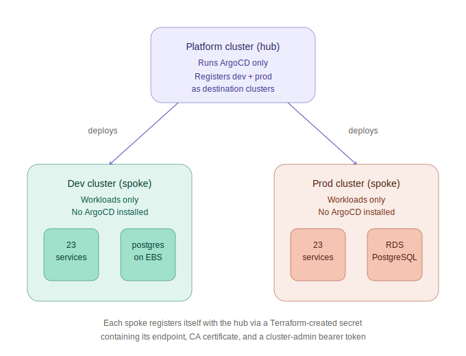
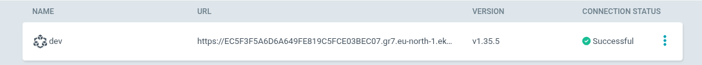
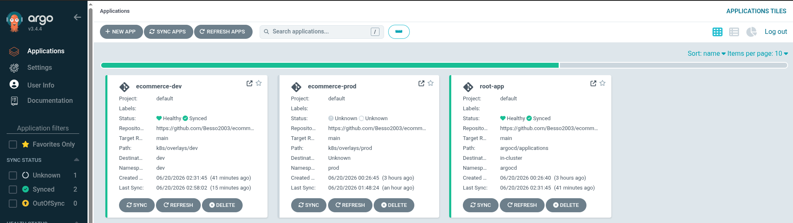

# ArgoCD GitOps Configuration

This folder defines how ArgoCD deploys and manages the `dev` and `prod` Kubernetes clusters using a hub-and-spoke architecture.

## Architecture



ArgoCD runs in exactly one place — the `platform` cluster — and is given remote access to deploy into `dev` and `prod`. This mirrors how companies running multiple clusters typically operate ArgoCD (one control plane, many managed clusters) rather than installing a separate ArgoCD per cluster.

## How Cluster Registration Works

Each workload environment's Terraform (`terraform/environments/dev`, `terraform/environments/prod`) creates:

- An `argocd-manager` ServiceAccount with `cluster-admin` permissions
- A long-lived token Secret for that ServiceAccount
- A Secret written directly into the **hub's** `argocd` namespace, labeled `argocd.argoproj.io/secret-type: cluster`, containing the cluster's endpoint, CA certificate, and the bearer token

This means cluster registration is fully automated as part of `terraform apply` for each environment. No manual `argocd cluster add` commands are needed.


## App of Apps Bootstrap

```
root-app.yaml
  -- the only manifest applied manually, once
  -- watches argocd/applications/
       -- ecommerce-dev.yaml   -> deploys k8s/overlays/dev  to cluster "dev"
       -- ecommerce-prod.yaml  -> deploys k8s/overlays/prod to cluster "prod"
```

After `root-app.yaml` is applied, every other Application is picked up automatically from git. Adding a new environment means only adding a new file to `argocd/applications/` and pushing. No further manual steps are required.

### One-Time Manual Bootstrap (after a fresh `platform` cluster)

```bash
aws eks update-kubeconfig --name ecommerce-platform-cluster --region eu-north-1
kubectl apply -f argocd/root-app.yaml
```

## Proof of Working Sync



## Known Limitations / Tradeoffs

- The `platform` hub cluster is destroyable like `dev`/`prod`, to minimize cost during development. In a real production setup, the hub would remain always-on so cluster registrations and Application history persist across workload cluster rebuilds.
- Destroying and recreating `dev` or `prod` requires no ArgoCD changes. Terraform re-creates the registration secret automatically, and ArgoCD picks the cluster back up once it is reachable again.
- Destroying and recreating `platform` requires re-running the one-time bootstrap step above, and re-running `terraform apply` for any currently-running `dev`/`prod` environments so they re-register.
- Secrets referenced in `k8s/base/*/secret.yaml` are normally excluded from git via `.gitignore`. ArgoCD builds manifests directly from git, so any service whose Kustomize config references a `secret.yaml` will fail to sync with a `ComparisonError` unless that file is either committed (acceptable for non-sensitive placeholder values, e.g. `payment-secret`, dev's `postgres-secret`) or replaced with an `ExternalSecret` sourced from AWS Secrets Manager (used for prod's real RDS credentials).
- There is currently no Ingress Controller installed in either cluster. Any `Ingress` resource will stay in a `Progressing` state indefinitely since nothing fulfills it. Ingress resources have been removed from the overlays until a controller, such as `ingress-nginx` or the AWS Load Balancer Controller, is added alongside a real domain.

## Adding a New Environment

1. Add the same ArgoCD-manager and cluster-registration Terraform block used in `terraform/environments/dev/main.tf` to the new environment's `main.tf`, with the cluster name and CIDR updated.
2. Run `terraform apply` for the new environment.
3. Add a new `argocd/applications/<env>.yaml` Application manifest, pointing `source.path` at the matching `k8s/overlays/<env>` folder and `destination.name` at the registered cluster name.
4. Push to git. ArgoCD picks it up automatically through the root app.