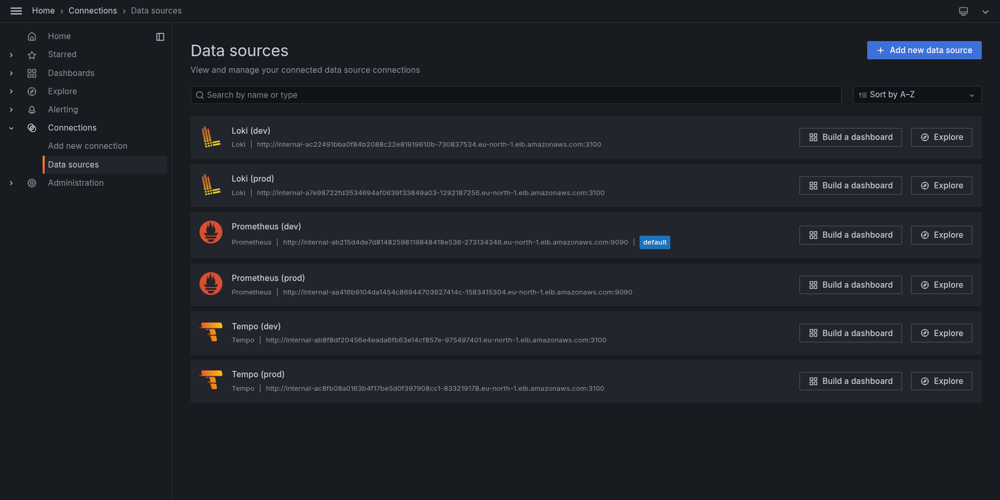

# Observability Stack

This folder contains the Kubernetes manifests for the OpenTelemetry Collector, deployed as part of the observability stack across dev and prod clusters. The full observability infrastructure (Prometheus, Loki, Tempo, Grafana) is provisioned via Terraform Helm releases.

---

## Architecture

```
Dev cluster                          Prod cluster
─────────────────────────────────    ─────────────────────────────────
23 microservices                     23 microservices
  │ OTLP (4317)                        │ OTLP (4317)
  ▼                                    ▼
otel-collector                       otel-collector
  │ metrics → Prometheus               │ metrics → Prometheus
  │ traces  → Tempo                    │ traces  → Tempo
  │ logs    → Loki                     │ logs    → Loki
  ▼                                    ▼
Prometheus  Loki   Tempo            Prometheus  Loki   Tempo
(EBS 15d)  (S3)   (S3+IRSA)        (EBS 30d)  (S3)   (S3+IRSA)
  │           │      │                │           │      │
  └───────────┴──────┘                └───────────┴──────┘
        internal LB                         internal LB
              │                                   │
              └──────────── VPC peering ──────────┘
                                  │
                            Platform cluster
                            ─────────────────
                            Grafana (single pane of glass)
                            6 datasources: Prometheus/Loki/Tempo
                            for both dev and prod
```

### Key design decisions

**Per-cluster backends, centralized Grafana** — each cluster runs its own Prometheus, Loki, and Tempo. Grafana on the platform cluster queries all backends remotely via VPC peering. This means if the platform cluster goes down, telemetry collection continues uninterrupted in dev and prod — data is never lost, you just can't view it until platform comes back.

**S3-backed Loki and Tempo** — both dev and prod use S3 for Loki and Tempo storage. Data survives cluster recreation entirely. This directly mirrors the same "decouple stateful data from the cluster lifecycle" philosophy used for RDS in prod. The ~$2-4/month S3 cost is negligible compared to losing observability history every time a cluster is destroyed.

**Private connectivity via VPC peering** — Prometheus, Loki, and Tempo are exposed via internal AWS Load Balancers (not public). Grafana reaches them through VPC peering connections between the platform VPC (10.3.0.0/16) and dev (10.0.0.0/16) and prod (10.2.0.0/16) VPCs. No observability endpoint is reachable from the public internet.

**Tempo uses IRSA, Loki uses Pod Identity** — Tempo 2.5.0 vendors an older AWS Go SDK that predates full EKS Pod Identity support (which injects credentials via `AWS_CONTAINER_AUTHORIZATION_TOKEN_FILE`). Pod Identity works correctly for Loki (which uses a more recent SDK). Tempo uses IRSA (`AWS_WEB_IDENTITY_TOKEN_FILE` + `AWS_ROLE_ARN` annotation) which is supported by every AWS SDK version.

**otel-collector routes all three signals** — a single OpenTelemetry Collector deployment receives metrics, traces, and logs from all 23 services via OTLP (port 4317/4318) and routes them to the correct backend. The spanmetrics connector generates RED metrics (request rate, error rate, duration) from traces automatically, enabling the Tempo Service Graph without any additional instrumentation.

---

## Components

### Per-cluster (dev and prod)

| Component | Chart | Version | Storage | Auth |
|---|---|---|---|---|
| kube-prometheus-stack | prometheus-community/kube-prometheus-stack | 61.3.0 | EBS (15d dev, 30d prod) | — |
| Loki | grafana/loki | 6.7.3 | S3 | Pod Identity |
| Tempo | grafana/tempo | 1.10.3 | S3 | IRSA |
| otel-collector | custom manifests | 0.105.0 | — | — |

### Platform cluster only

| Component | Chart | Version | Notes |
|---|---|---|---|
| Grafana | grafana/grafana | 8.3.6 | 6 datasources pre-configured |

---

## Screenshots

### Grafana datasources — all 6 green



All six datasources (Prometheus, Loki, Tempo for both dev and prod) connected via private VPC peering — zero public endpoints.

### Kubernetes cluster metrics dashboard


Pre-loaded Kubernetes cluster overview dashboard showing real-time CPU, memory, network, and pod metrics from the dev cluster.

### Service Graph — live dependency map


Auto-generated service dependency map derived purely from distributed traces — no manual configuration. Shows real-time request rates and response times between services (user → frontend → checkout → cart/payment/shipping/currency → kafka).

### Distributed trace waterfall


A complete request trace showing the full journey across multiple services with per-span timing. Generated from real traffic produced by the load-generator service.

### Logs in Loki


Pod logs from the dev cluster queryable by service: `{job="opentelemetry-demo/cart"}` shows cart service logs in real time.

---

## S3 Storage Layout

```
ecommerce-dev-loki-707938860152/
  index/
  chunks/

ecommerce-dev-tempo-707938860152/
  single-tenant/
    <block-uuid>/
      bloom-0        (bloom filter for fast span lookup)
      data.parquet   (actual trace data)
      index          (block index)
      meta.json      (block metadata)
    index.json.gz    (tenant-level block index)

ecommerce-prod-loki-707938860152/   (same structure)
ecommerce-prod-tempo-707938860152/  (same structure)
```

---

## Accessing Grafana

Grafana is exposed via an internal LoadBalancer on the platform cluster. Access it via port-forward:

```bash
aws eks update-kubeconfig --name ecommerce-platform-cluster --region eu-north-1 --profile bassant
kubectl port-forward -n monitoring svc/grafana 3000:80
```

Open `http://localhost:3000` — login with `admin` / `admin123`.

---

## Useful Queries

### Metrics (Prometheus)

```promql
# Request rate per service (from spanmetrics)
sum(rate(traces_spanmetrics_calls_total[5m])) by (service_name)

# Error rate per service
sum(rate(traces_spanmetrics_calls_total{status_code="STATUS_CODE_ERROR"}[5m])) by (service_name)

# Pod CPU usage
sum(rate(container_cpu_usage_seconds_total{namespace="dev"}[5m])) by (pod)

# All targets up
up
```

### Logs (Loki)

```logql
# All dev logs
{namespace="dev"}

# Specific service logs
{job="opentelemetry-demo/cart"}

# Error logs only
{namespace="dev"} |= "error"

# Checkout service errors
{job="opentelemetry-demo/checkout"} |= "error"
```

### Traces (Tempo — TraceQL)

```
# All checkout traces
{ resource.service.name = "checkout" }

# Slow traces (>500ms)
{ duration > 500ms }

# Failed traces
{ status = error }

# Traces touching both checkout and payment
{ resource.service.name = "checkout" } && { resource.service.name = "payment" }
```

---

## otel-collector Pipeline

```yaml
receivers:
  otlp:           # Receives from all 23 services on 4317/4318
  prometheus:     # Scrapes its own metrics

exporters:
  otlp/tempo:           # Traces → Tempo
  otlphttp/prometheus:  # Metrics → Prometheus (OTLP write receiver)
  loki:                 # Logs → Loki

connectors:
  spanmetrics:    # Generates RED metrics from traces automatically

pipelines:
  traces:  [otlp] → [memory_limiter, transform, batch] → [tempo, spanmetrics]
  metrics: [otlp, prometheus, spanmetrics] → [memory_limiter, batch] → [prometheus]
  logs:    [otlp] → [memory_limiter, resource, batch] → [loki]
```

The `transform` processor cleans up Next.js route names (removes query strings, normalizes product ID routes). The `resource` processor tags logs with `service.name` and `k8s.namespace.name` for Loki label filtering.

---

## Known Limitations

**Prometheus metrics are EBS-backed** — unlike Loki and Tempo which use S3, Prometheus data lives on EBS and is lost when a cluster is destroyed. For production use, this should be replaced with Thanos or Grafana Mimir (both support S3 long-term storage with remote_write). Documented as a future enhancement.

**No alerting configured** — Alertmanager is deployed as part of kube-prometheus-stack but no alert rules are defined yet. Adding PrometheusRule resources for common failure modes (pod crash loops, high error rates, disk pressure) is a natural next step.

**Platform going down = no Grafana** — because Grafana is on the platform cluster, destroying platform makes metrics/logs/traces temporarily unviewable. The data itself is safe in S3 and in dev/prod's local Prometheus. Grafana comes back automatically when platform is re-applied.

**VPC peering vs PrivateLink** — the observability backends are connected via VPC peering, which opens a full network path between VPCs rather than exposing only specific service endpoints. In a stricter compliance environment, AWS PrivateLink would expose only the specific ports needed (Prometheus 9090, Loki 3100, Tempo 3100/4317) without opening the broader VPC network path.

---

## Future Enhancements

- **Thanos or Grafana Mimir** for long-term S3-backed metrics storage (replacing EBS-backed Prometheus)
- **PrometheusRule resources** for standard Kubernetes and application alerting
- **Alertmanager routes** to Slack/PagerDuty for production alerts
- **AWS PrivateLink** instead of VPC peering for tighter network security
- **Log-to-trace correlation** — configure Loki derived fields to link log lines to their trace IDs in Tempo
- **Exemplars** — configure Prometheus exemplars to link metric spikes directly to the traces that caused them