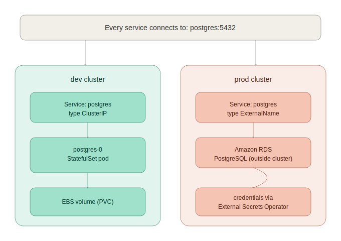

# Kubernetes Manifests

This folder contains all Kubernetes manifests for the ecommerce platform — 23 microservices deployed across two environments (`dev` and `prod`) using Kustomize, managed by ArgoCD.

See `../argocd/README.md` for how these manifests actually get applied to the clusters, and `../Terraform/README.md` for how the clusters themselves are provisioned.

---

## Folder Structure

```
k8s/
├── base/                        # Reusable manifests — never applied directly
│   ├── accounting/
│   ├── ad-service/
│   ├── cart/
│   ├── checkout/
│   ├── currency/
│   ├── email/
│   ├── flagd/
│   ├── flagd-ui/
│   ├── fraud-detection/
│   ├── frontend/
│   ├── frontend-proxy/
│   ├── image-provider/
│   ├── kafka/
│   ├── llm/
│   ├── load-generator/
│   ├── payment/
│   ├── postgres/
│   ├── product-catalog/
│   ├── product-reviews/
│   ├── quote/
│   ├── recommendation-service/
│   ├── shipping/
│   ├── valkey/
│   ├── storage/                 # StorageClass (ebs-gp3, CSI-backed)
│   └── network-policies/        # Zero-trust NetworkPolicy per service
│
└── overlays/                    # Environment-specific configuration
    ├── dev/
    │   ├── patches/              # Resource limits and replica overrides
    │   ├── namespace.yaml
    │   └── kustomization.yaml
    └── prod/
        ├── patches/
        ├── external-secrets/     # ClusterSecretStore, ExternalSecret,
        │                          # and ExternalName service for RDS
        ├── namespace.yaml
        └── kustomization.yaml
```

A `staging` environment existed earlier in this project but was removed to control AWS cost during development. `dev` and `prod` are sufficient for the project's current scope; see `../Terraform/README.md` for the reasoning.

---

## What Each Service Folder Contains

Every stateless service folder under `base/` follows this structure:

```
<service>/
  deployment.yaml       # Pod spec, image, env vars, probes, resource limits
  service.yaml           # ClusterIP service (or LoadBalancer for frontend-proxy)
  configmap.yaml         # All non-sensitive environment variables
  serviceaccount.yaml    # Dedicated service account
  hpa.yaml                # HorizontalPodAutoscaler — scales on CPU at 70%
  pdb.yaml                # PodDisruptionBudget — prevents total downtime
  kustomization.yaml      # Lists all resources in this folder
```

`payment` and dev's `postgres` additionally have a plain `secret.yaml`. These hold non-sensitive placeholder values only (a fake Stripe token, and dev's throwaway local database password) and are intentionally committed to git so ArgoCD can build their manifests. See **Secrets Management** below for why this is safe here but would not be for a real credential.

Stateful services (postgres, kafka, valkey) use a different structure:

```
<service>/
  statefulset.yaml        # StatefulSet with volumeClaimTemplates
  service.yaml             # ClusterIP service for normal client connections
  service-headless.yaml    # Headless service for stable per-pod DNS
  configmap.yaml            # Non-sensitive environment variables
  serviceaccount.yaml        # Dedicated service account
  pdb.yaml                    # PodDisruptionBudget
  kustomization.yaml           # Lists all resources in this folder
```

**Note on postgres specifically:** in `prod`, the `postgres` StatefulSet is not deployed at all. Prod uses Amazon RDS instead — see the **Prod Database (RDS)** section below.

---

## Environments

| Environment | Replicas | Resources | PDB minAvailable | Namespace | Database |
|---|---|---|---|---|---|
| dev | 1 | small | 0 | dev | in-cluster postgres (StatefulSet, EBS) |
| prod | 2 | larger | 2 | prod | Amazon RDS PostgreSQL (Multi-AZ capable) |

The differences between environments are replica counts, resource limits, PDB values, and — uniquely for prod — the database backend. All other configuration is identical and lives in `base/`.

---

## Prod Database (RDS)



Unlike dev, `prod` does not run a `postgres` StatefulSet. The `postgres` base folder is excluded from `k8s/overlays/prod/kustomization.yaml`, and is replaced by three resources under `k8s/overlays/prod/external-secrets/`:

```
external-secrets/
  secretstore.yaml               # ClusterSecretStore — tells External
  │                                Secrets Operator how to read AWS
  │                                Secrets Manager via IRSA
  postgres-external-secret.yaml  # ExternalSecret — pulls the RDS
  │                                credentials Terraform generated and
  │                                creates a k8s Secret named
  │                                postgres-secret (same name every
  │                                other service already expects)
  postgres-service.yaml           # type: ExternalName Service named
                                   # postgres, pointing at the real RDS
                                   # endpoint
```

This means every service that connects to `postgres:5432` (e.g. `accounting`, `product-reviews`) reaches the real RDS instance transparently — no service code or connection string had to change between dev and prod.

The full mechanics of how the RDS password reaches this Secret (Terraform → `random_password` → AWS Secrets Manager → External Secrets Operator → k8s Secret) are documented in `../Terraform/README.md`.

---

## Stateful Services

Postgres (dev only), Kafka, and Valkey are deployed as **StatefulSets** rather than Deployments. This is a deliberate architectural decision based on how these services manage state.

### Why StatefulSet over Deployment

A Deployment treats all pods as identical and interchangeable. For stateless services this is correct — any pod can handle any request. For stateful services this causes problems:

- A Deployment pod gets a random name (`postgres-59944c77df-t8gkl`) that changes on every restart
- PVCs are not guaranteed to reattach to the same pod
- No ordered startup or shutdown — a database that starts before its storage is mounted will corrupt data

A StatefulSet solves all three:

| Feature | Deployment | StatefulSet |
|---|---|---|
| Pod name | Random, changes on restart | Stable (`postgres-0`, `kafka-0`) |
| PVC binding | Manual PVC, any pod can claim it | Each pod gets its own PVC, always reattaches |
| Startup order | Parallel, random | Ordered (0 → 1 → 2) |
| Shutdown order | Parallel, random | Reverse ordered (2 → 1 → 0) |
| DNS | `kafka.dev.svc.cluster.local` | `kafka-0.kafka-headless.dev.svc.cluster.local` |

### Headless Service

Each StatefulSet has a **headless service** (`clusterIP: None`) alongside a regular ClusterIP service. The regular service gives a single virtual IP that load-balances across pods — this is what other services actually connect to (`kafka:9092`, `valkey:6379`). The headless service gives each pod a stable, predictable DNS entry for cases where a client needs a *specific* instance:

```text
kafka-0.kafka-headless.dev.svc.cluster.local
valkey-0.valkey-headless.dev.svc.cluster.local
postgres-0.postgres-headless.dev.svc.cluster.local   (dev only)
```

### volumeClaimTemplates

Instead of a separate `pvc.yaml`, StatefulSets use `volumeClaimTemplates` inside the spec. Kubernetes automatically creates one PVC per pod and names it predictably:

```text
kafka-data-kafka-0
valkey-data-valkey-0
postgres-data-postgres-0   (dev only)
```

If a pod is deleted and recreated, it automatically reattaches to its existing PVC — the data is never lost. Storage is backed by the `ebs-gp3` StorageClass defined in `k8s/base/storage/`, which uses the AWS EBS CSI driver provisioned by Terraform's `eks` module.

---

## Services

### Stateless Services (Deployment + Service + ConfigMap + HPA + PDB)

| Service | Port | Language | Dependencies |
|---|---|---|---|
| ad-service | 9099 | Java | flagd |
| cart | 8080 | .NET | valkey, flagd |
| checkout | 5050 | Go | cart, currency, email, payment, product-catalog, shipping, kafka, flagd |
| currency | 7001 | C++ | — |
| email | 6060 | Ruby | — |
| flagd | 8013 | Go | — |
| flagd-ui | 4000 | Elixir | flagd |
| fraud-detection | — | Kotlin | kafka, flagd |
| accounting | — | .NET | kafka |
| frontend | 8080 | TypeScript | all backend services |
| frontend-proxy | 8080 | Envoy | frontend, flagd, flagd-ui, image-provider |
| image-provider | 8081 | nginx | — |
| llm | 8000 | Python | — |
| load-generator | 8089 | Python | frontend-proxy |
| payment | 50051 | JavaScript | flagd |
| product-catalog | 8088 | Go | flagd |
| product-reviews | 3551 | Python | llm, postgres, flagd |
| quote | 8090 | PHP | — |
| recommendation-service | 1010 | Python | product-catalog, flagd |
| shipping | 50050 | Rust | quote |

### Stateful Services (StatefulSet + Service(s) + ConfigMap + PDB)

| Service | Port | Purpose | Storage | Present in |
|---|---|---|---|---|
| postgres | 5432 | Relational database | 1Gi EBS | dev only (prod uses RDS) |
| kafka | 9092 | Message queue | 1Gi EBS | dev + prod |
| valkey | 6379 | Redis-compatible cache | 512Mi EBS | dev + prod |

---

## Network Policies

Zero-trust networking — all traffic is denied by default, then explicitly allowed per service. Each service has its own NetworkPolicy that only permits the exact connections it actually needs.

Key policies:
- `default-deny-all.yaml` — blocks all ingress and egress for every pod
- `allow-dns.yaml` — allows all pods to reach kube-dns (required for service discovery)
- Per-service policies — only open the specific ports and directions each service needs

---

## Health Probes

Every service has probes configured to ensure Kubernetes only routes traffic to healthy pods and automatically restarts stuck ones. Three probe types are used depending on the service's characteristics.

### Probe Types

**startupProbe** — runs only during pod startup. Kubernetes waits for this to pass before running liveness or readiness probes. Used for slow-starting services like Kafka and Postgres that need time to initialize before accepting connections.

**readinessProbe** — tells Kubernetes when the pod is ready to receive traffic. A failing readiness probe removes the pod from the Service endpoints without restarting it. Used by every service.

**livenessProbe** — tells Kubernetes when to restart a pod. Only used when a stuck/deadlocked process won't recover on its own. Not used for Kafka — a slow broker is better than a restarting one.

### Probe Matrix

| Service | Startup | Readiness | Liveness | Method |
|---|---|---|---|---|
| product-catalog | ✓ | ✓ | ✓ | gRPC |
| ad-service | ✓ | ✓ | ✓ | gRPC |
| recommendation-service | ✓ | ✓ | ✓ | gRPC |
| cart | ✓ | ✓ | ✓ | gRPC |
| checkout | ✓ | ✓ | ✓ | gRPC |
| payment | ✓ | ✓ | ✓ | gRPC |
| shipping | ✓ | ✓ | ✓ | gRPC |
| currency | ✓ | ✓ | ✓ | TCP |
| email | — | ✓ | ✓ | TCP |
| frontend | ✓ | ✓ | ✓ | HTTP GET / |
| frontend-proxy | — | ✓ | ✓ | HTTP GET / |
| image-provider | — | ✓ | ✓ | TCP |
| quote | — | ✓ | ✓ | TCP |
| load-generator | — | ✓ | ✓ | HTTP GET / |
| llm | — | ✓ | ✓ | HTTP GET / |
| flagd | — | ✓ | ✓ | HTTP GET /readyz |
| flagd-ui | — | ✓ | ✓ | TCP |
| fraud-detection | — | ✓ | — | TCP |
| accounting | — | ✓ | — | TCP |
| product-reviews | — | ✓ | ✓ | TCP |
| postgres (dev) | ✓ | ✓ | ✓ | pg_isready |
| kafka | ✓ | ✓ | ✗ | TCP |
| valkey | ✗ | ✓ | ✓ | TCP |

### Why Kafka has no livenessProbe

Kafka is a stateful message broker. If it becomes temporarily slow due to high load, a liveness probe restart would cause it to lose in-flight messages and force consumers to replay from their last committed offset. A slow Kafka is recoverable — a restarting Kafka causes cascading failures across checkout, fraud-detection, and accounting. The startupProbe gives Kafka time to initialize, and the readinessProbe removes it from traffic if it becomes unresponsive, without triggering a destructive restart.

### Why Valkey has no startupProbe

Valkey (Redis-compatible) starts in under 1 second. A startupProbe would add unnecessary delay before the readiness check begins. The readinessProbe with a short initial delay is sufficient.

---

## Secrets Management

This project intentionally uses **two different approaches** depending on whether a secret is real or a placeholder, rather than applying one heavyweight mechanism everywhere regardless of actual risk.

### Real credentials — prod's RDS password

```text
Terraform generates a 32-character random_password
     ↓
Stored in AWS Secrets Manager
     ↓
External Secrets Operator (IRSA-authenticated) reads it via a
ClusterSecretStore
     ↓
An ExternalSecret creates a k8s Secret named postgres-secret in the
prod namespace
     ↓
Pods consume it exactly as they would any other k8s Secret
```

The real password is never typed by a human, never appears in this repo, and never appears in a plain Kubernetes Secret manifest. Full details are in `../Terraform/README.md`.

### Non-sensitive placeholders — payment, and dev's postgres

`payment-secret` holds a fake Stripe token (`fake-stripe-token`) and dev's `postgres-secret` holds a throwaway local database password (`otel`/`otel`). Neither is connected to any real external system or real data. These are committed to git as plain `secret.yaml` files because:

- ArgoCD builds manifests directly from git — a `.gitignore`'d file that Kustomize references will fail the sync with a `ComparisonError`
- There is no real secret to protect: leaking these values has zero real-world impact

If either of these is ever replaced with a real credential (a real Stripe test key, for example), it should be migrated to the same Terraform → Secrets Manager → External Secrets Operator pattern used for RDS, not left as a plain committed secret.

### Sealed Secrets

This project does not use Sealed Secrets. Earlier drafts of this README referenced Sealed Secrets and `kubeseal`, but the project settled on the External Secrets Operator + AWS Secrets Manager pattern above instead, since the clusters run on EKS with native AWS integration available via IRSA.

---

## How to Apply

Manifests in this folder are applied by **ArgoCD**, not by running `kubectl apply -k` directly. See `../argocd/README.md` for the full GitOps setup, including the one-time bootstrap step.

For local testing or debugging without going through ArgoCD:

```bash
# Dev
kubectl apply -k k8s/overlays/dev

# Prod
kubectl apply -k k8s/overlays/prod
```

Manual changes made this way will be reverted automatically the next time ArgoCD reconciles, since `selfHeal: true` is enabled on both Applications. Treat `kubectl apply -k` as a quick local check only — the actual deployment mechanism is a `git push`.

### Verify

```bash
kubectl get pods -n dev
kubectl get svc -n dev
kubectl get hpa -n dev
kubectl get pdb -n dev
kubectl get networkpolicy -n dev
kubectl get pvc -n dev
kubectl get statefulsets -n dev
```

Swap `dev` for `prod` to check the other environment. For prod, also check the secret sync specifically:

```bash
kubectl get externalsecret -n prod
kubectl get clustersecretstore
```

---

## Key Design Decisions

**Kustomize over Helm** — Kustomize is built into kubectl, requires no templating language, and is natively supported by ArgoCD. Helm adds complexity that isn't needed when you control all the manifests.

**StatefulSet for stateful services** — Kafka and Valkey (and Postgres in dev) use StatefulSets instead of Deployments. This ensures stable pod names, guaranteed PVC reattachment, and ordered startup/shutdown. Each StatefulSet has a headless service for stable per-pod DNS, alongside a regular service for normal client connections.

**RDS for prod's database, EBS-backed StatefulSet for dev's** — prod gets a managed, Multi-AZ-capable database with automated backups; dev keeps a cheap, throwaway in-cluster database, since dev environments are destroyed and recreated frequently and have no real data worth protecting.

**One service account per service** — each pod has its own Kubernetes ServiceAccount, allowing per-service IAM permissions via IRSA where needed (e.g. External Secrets Operator's ServiceAccount).

**ConfigMaps for all non-sensitive config** — all non-sensitive settings are stored in Kubernetes ConfigMaps, eliminating hardcoded values from deployment manifests.

**Secret management proportional to actual risk** — real credentials (RDS) go through Terraform + Secrets Manager + External Secrets Operator; non-sensitive placeholder values are committed in plain text rather than over-engineered with unnecessary encryption.

**HPA at 70% CPU** — scales up before services become saturated. `minReplicas: 1` in dev, `minReplicas: 2` in prod ensures no single point of failure in prod.

**PDB prevents total downtime** — during node drain or rolling updates, Kubernetes will not evict pods if it would violate the PodDisruptionBudget. `minAvailable: 2` in prod means at least 2 replicas always stay running.

**Zero-trust NetworkPolicy** — all pod-to-pod traffic is denied by default. Each service has an explicit NetworkPolicy that only permits the exact connections it needs.

**No Ingress Controller yet** — Ingress resources were removed from both overlays after sitting permanently in a `Progressing` state with no controller installed to fulfill them. Both environments are currently accessed via the `frontend-proxy` LoadBalancer Service directly. An Ingress Controller (`ingress-nginx` or the AWS Load Balancer Controller) will be reintroduced alongside a real domain.

---

## Adding a New Service

1. Create `k8s/base/<service-name>/` with all required files
2. Add it to `k8s/overlays/dev/kustomization.yaml` resources and patches
3. Add it to `k8s/overlays/prod/kustomization.yaml` resources and patches
4. Add a NetworkPolicy in `k8s/base/network-policies/`
5. Push to git — ArgoCD picks up the change automatically

---

## Troubleshooting

```bash
# Pod not starting
kubectl describe pod -n dev -l app=<service>
kubectl logs -n dev deployment/<service> --tail=20

# StatefulSet pod not starting
kubectl describe pod -n dev <service>-0
kubectl logs -n dev <service>-0 --tail=20

# Service not reachable
kubectl get svc -n dev
kubectl get networkpolicy -n dev

# HPA not scaling
kubectl top pods -n dev
kubectl describe hpa -n dev <service>

# PVC not binding
kubectl get pvc -n dev
kubectl describe pvc -n dev <service>-data-<service>-0

# ArgoCD sync failing with ComparisonError mentioning a secret.yaml
# → the file is probably still in .gitignore. See "Secrets Management"
#   above, and ../argocd/README.md "Known Limitations" for the fix.

# Prod's postgres ExternalSecret not syncing
kubectl get externalsecret -n prod
kubectl describe externalsecret rds-postgres-secret -n prod
# Usually means the external-secrets ServiceAccount lost its IRSA
# annotation — see ../Terraform/README.md for the fix.
```